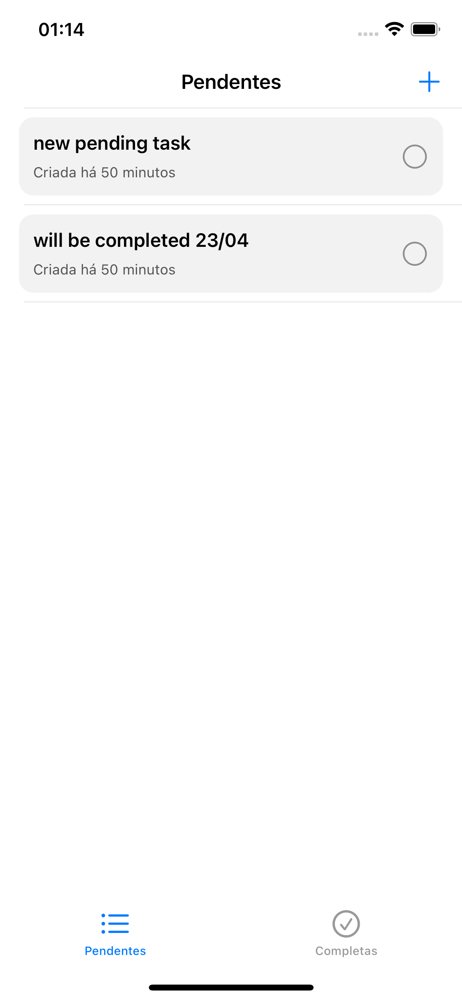
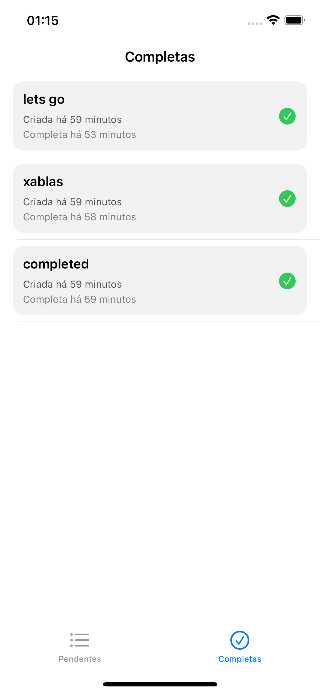

# ToDoListVIPER
 
# Simple project using 
- Swift
- UIKit
- ViewCode wiht Snapkit
- CoreData

## Screenshots

| Pending | Adding new Task | Completed |
|---------|-----------------|-----------|
|  |  |  
